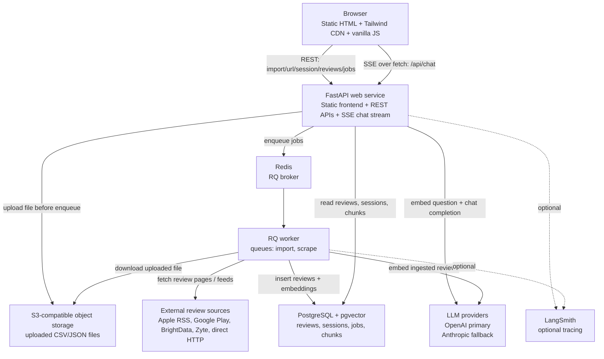
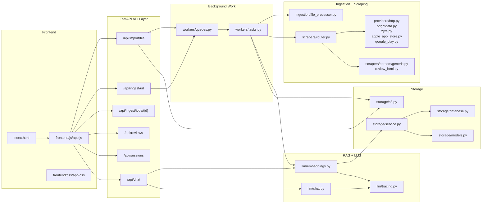
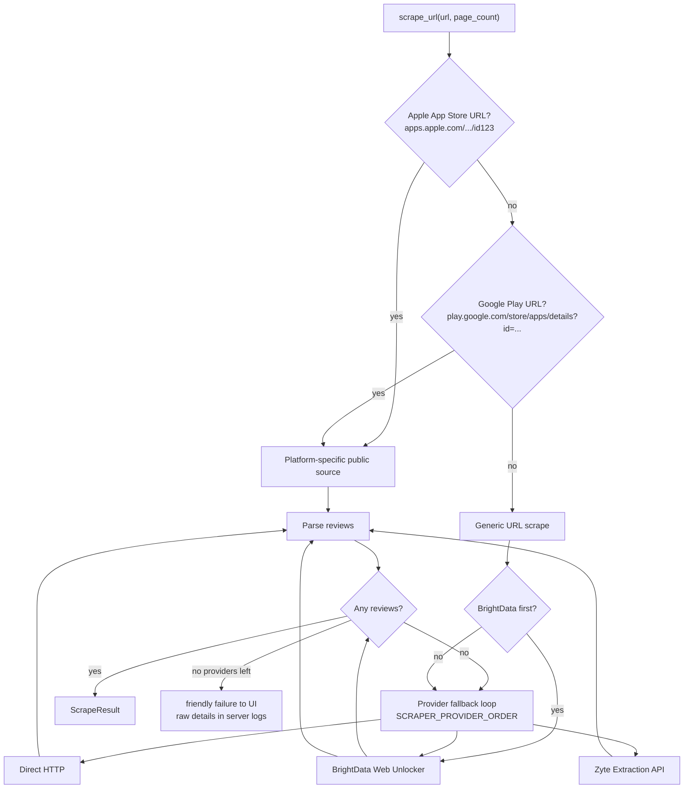
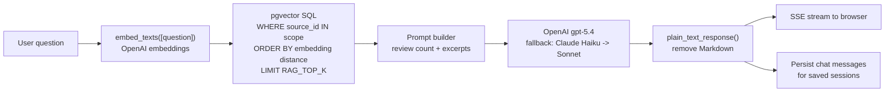
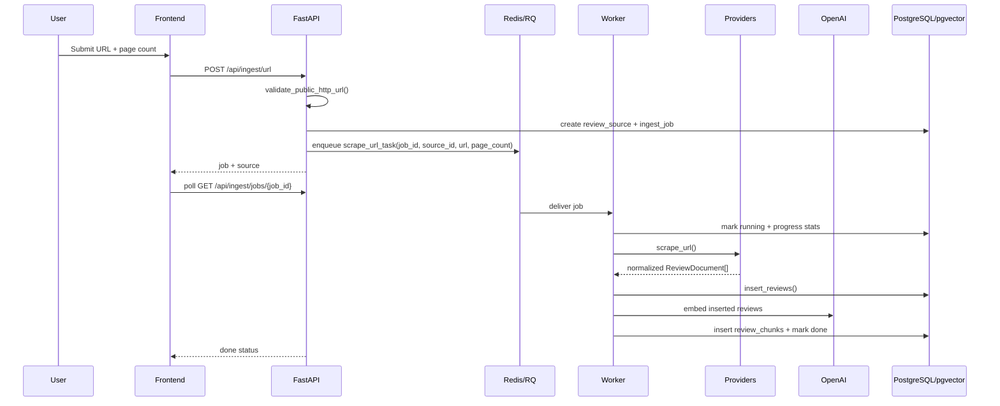
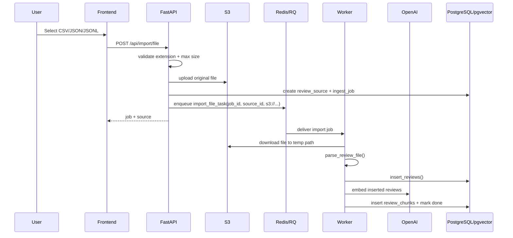

# ReviewLens AI — System Design

**Status:** Active design  
**Last updated:** 2026-04-28

ReviewLens AI ingests product and app reviews from URLs or CSV/JSON uploads, stores normalized reviews in PostgreSQL, embeds review text into pgvector, and exposes a review-scoped RAG chat interface. The current implementation is intentionally backend-first, with a static HTML/vanilla JS frontend served by FastAPI.

---

## 1. Current Architecture



### Runtime Services

| Service | Responsibility |
|---|---|
| FastAPI web | Serves frontend, accepts import/scrape requests, saves sessions, streams chat answers, exposes job status. |
| Redis | RQ broker for `import` and `scrape` queues. |
| RQ worker | Processes uploaded files, URL scrapes, review insertions, and embeddings. |
| PostgreSQL + pgvector | Primary store for sources, jobs, reviews, sessions, chat history, and vector chunks. |
| S3-compatible storage | Shared object storage for uploaded CSV/JSON files so Render web and worker services can both access them. |
| External LLM APIs | OpenAI for embeddings and primary chat; Anthropic for fallback chat. |
| LangSmith | Optional tracing for embedding, retrieval, and chat paths. |

---

## 2. Logical Architecture



---

## 3. Directory Structure

The current codebase is a single FastAPI app plus static frontend.

```text
reviewlens-ai/
├── alembic/
│   ├── env.py
│   └── versions/
│       ├── 20260427_0001_initial_schema.py
│       ├── 20260427_0002_sessions.py
│       └── 20260427_0003_review_chunks.py
├── backend/
│   ├── api/
│   │   └── routes/
│   │       ├── chat.py        # scoped RAG chat, SSE streaming, suggestions/topics
│   │       ├── imports.py     # CSV/JSON upload, S3 handoff, import queue
│   │       ├── ingest.py      # URL ingest, SSRF validation, scrape queue
│   │       ├── jobs.py        # status polling and cancellation
│   │       ├── reviews.py     # review browsing and filters
│   │       └── sessions.py    # saved sessions and chat history
│   ├── core/
│   │   └── url_validation.py
│   ├── ingestion/
│   │   ├── dedupe.py
│   │   ├── file_processor.py
│   │   └── models.py
│   ├── llm/
│   │   ├── chat.py           # OpenAI primary, Anthropic fallback, plain-text cleanup
│   │   ├── embeddings.py     # OpenAI embeddings + pgvector retrieval
│   │   └── tracing.py        # optional LangSmith trace wrapper/redaction
│   ├── scrapers/
│   │   ├── models.py
│   │   ├── router.py         # platform routing and provider fallback
│   │   ├── parsers/
│   │   │   ├── generic.py    # JSON-LD, microdata, embedded JSON, HTML cards
│   │   │   └── review_html.py # TripAdvisor helper parser
│   │   ├── providers/
│   │   │   ├── apple_app_store.py # Apple public RSS reviews
│   │   │   ├── google_play.py     # google-play-scraper adapter
│   │   │   ├── brightdata.py
│   │   │   ├── http.py
│   │   │   └── zyte.py
│   │   └── utils/
│   │       ├── pagination.py
│   │       └── platform_detection.py
│   ├── storage/
│   │   ├── database.py       # async SQLAlchemy engine/session
│   │   ├── models.py         # ORM models for relational tables
│   │   ├── s3.py             # shared uploaded-file storage
│   │   └── service.py        # storage/query helpers and serializers
│   ├── workers/
│   │   ├── queues.py
│   │   └── tasks.py          # import_file_task, scrape_url_task
│   ├── config.py
│   └── main.py
├── frontend/
│   ├── index.html
│   ├── css/app.css
│   └── js/app.js
├── scripts/
│   └── start-worker.sh
├── tests/
├── Dockerfile
├── docker-compose.yml
├── render.yaml
├── pyproject.toml
└── requirements.txt
```

---

## 4. Scraping Hierarchy

Scraping is routed by platform first, then falls back to the configurable provider order.



### Provider and Parser Order

1. **Apple App Store**  
   `apps.apple.com` URLs are converted to Apple’s public RSS endpoint:
   `https://itunes.apple.com/{country}/rss/customerreviews/page={n}/id={app_id}/sortby=mostrecent/json`.

2. **Google Play**  
   `play.google.com/store/apps/details?id=...` URLs use `google-play-scraper`, newest reviews first. One requested page maps to up to 100 reviews; `page_count` is capped.

3. **BrightData optimized path**  
   If `SCRAPER_PROVIDER_ORDER` starts with `brightdata`, the router first tries the BrightData scraper path that can handle multi-page retrieval and parser-specific diagnostics.

4. **Generic provider fallback**  
   The router loops through providers from `SCRAPER_PROVIDER_ORDER`, usually:
   `brightdata,zyte,http` in production or `http,brightdata,zyte` in local/dev.

5. **Generic parser stack**  
   After HTML fetch, `parse_generic_reviews()` tries:
   - TripAdvisor-specific helper for `tripadvisor.*`
   - JSON-LD/schema.org reviews
   - microdata reviews
   - embedded JSON state (`__NEXT_DATA__`, Apollo/Redux-like state)
   - heuristic HTML review cards

### Platform Notes

| Platform | Current implementation |
|---|---|
| Apple App Store | Public RSS JSON. No BrightData/Zyte needed. |
| Google Play | `google-play-scraper` package. No BrightData/Zyte needed. |
| TripAdvisor | Custom HTML parser through `review_html.py`, with provider fallback for fetching. |
| G2/Capterra/TrustRadius/Trustpilot/etc. | Generic parser stack through BrightData/Zyte/direct HTTP depending on availability. |
| Sites with hard blocking | Return friendly UI error; provider-specific details remain in server logs and job attempts. |

---

## 5. LLM and RAG Design

### Model Configuration

| Concern | Current choice |
|---|---|
| Primary chat model | `gpt-5.4` via `OPENAI_CHAT_MODEL` |
| Chat fallbacks | `claude-haiku-4.7`, then `claude-sonnet-4.7` via `ANTHROPIC_FALLBACK_MODELS` |
| Embeddings | OpenAI `text-embedding-3-small` |
| Embedding dimensions | `1536` by default; changing this requires a migration and full re-embed |
| Retrieval top-k | `RAG_TOP_K`, capped at 100 |
| Streaming | Server-sent events from `POST /api/chat` |
| Observability | Optional LangSmith tracing |

The app currently uses direct `httpx` calls to OpenAI and Anthropic instead of LangChain. This keeps the request path explicit and avoids framework coupling while still supporting provider fallback and LangSmith traces.

### RAG Scope Rule

Chat must be scoped to the active review set:

- If a saved session is selected, source IDs come from `review_session_sources`.
- If no saved session is selected, source IDs come from the current workspace ingestions.
- Retrieval SQL always filters by `source_id IN (...)` before ordering by vector distance.
- The system prompt instructs the model to answer only from supplied review excerpts.
- The prompt includes the **total review count** for the active scope so “how many reviews” answers do not confuse chunks with reviews.

### Retrieval Flow



### Chat Failure Behavior

- If no chunks are available for the current scope, the API returns a clear “no embedded review content” answer.
- If OpenAI fails before producing output, Anthropic fallback models are tried in configured order.
- If a streaming provider fails after partial output, the client receives an error event rather than silently switching mid-answer.

---

## 6. Ingestion Flows

### URL Ingestion



### File Import



### Job Cancellation

The frontend can call `POST /api/ingest/jobs/{job_id}/cancel`. Workers check cancellation before progress updates, before embedding, and before marking final success. Completed, failed, and cancelled jobs are terminal.

---

## 7. Storage Design

### Relational Tables

| Table | Purpose |
|---|---|
| `review_sources` | One row per uploaded file or scraped URL. Stores platform, URL, embedding model, and config such as S3 file info. |
| `ingest_jobs` | Tracks background job state, errors, stats, current page/provider, cancellation, and attempts. |
| `reviews` | Normalized review records with dedupe fingerprint per source. |
| `review_sessions` | Saved analysis sessions. |
| `review_session_sources` | Many-to-many link between sessions and sources. |
| `chat_messages` | Persisted chat history for saved sessions. |
| `review_chunks` | Raw SQL-managed pgvector table created by Alembic; contains review chunks and embeddings. |

### pgvector

`review_chunks.embedding` is `vector(1536)` by default. The HNSW index uses cosine distance:

```sql
CREATE INDEX review_chunks_embedding_idx
ON review_chunks USING hnsw (embedding vector_cosine_ops)
WITH (m = 16, ef_construction = 64);
```

The query path embeds the question, filters chunks by source IDs, and orders by vector distance:

```sql
SELECT review_id, source_id, content, metadata,
       1 - (embedding <=> CAST(:embedding AS vector)) AS score
FROM review_chunks
WHERE source_id IN :source_ids
ORDER BY embedding <=> CAST(:embedding AS vector)
LIMIT :limit;
```

---

## 8. Observability

### LangSmith

LangSmith is optional and disabled by default:

```bash
LANGSMITH_TRACING=false
LANGSMITH_API_KEY=
LANGSMITH_PROJECT=reviewlens-ai
LANGSMITH_ENDPOINT=https://api.smith.langchain.com
LANGSMITH_WORKSPACE_ID=
```

When enabled, the app traces:

- `embed_source_reviews`
- `embed_texts`
- `retrieve_relevant_chunks`
- OpenAI chat calls and streams
- Anthropic chat calls and streams
- model fallback chain

The tracing wrapper redacts API keys from settings objects and summarizes embedding vectors instead of sending the full numeric arrays.

### Server Logs

Raw scraper provider errors are logged server-side. The UI receives friendly messages for blocked or unparsable review sites.

---

## 9. Deployment

### Render

`render.yaml` defines:

- `reviewlens-ai-web`: Docker web service serving the frontend and API.
- `reviewlens-ai-worker`: Docker worker running `scripts/start-worker.sh`, listening on `import` and `scrape`.
- Required env vars for Postgres, Redis, S3, OpenAI, Anthropic, BrightData, Zyte, and optional LangSmith.

The Docker image runs:

```bash
alembic upgrade head && uvicorn backend.main:app --host 0.0.0.0 --port ${PORT:-8082}
```

The worker runs:

```bash
rq worker --url "$REDIS_URL" import scrape
```

### Local Docker

`docker-compose.yml` runs the web app, worker, and Redis locally. Database may be local, external, or managed depending on `DATABASE_URL`. `RUNNING_IN_DOCKER=1` prevents accidentally pointing a container at `localhost` for Postgres.

---

## 10. Security and Safety Boundaries

| Risk | Mitigation |
|---|---|
| SSRF from URL ingestion | `validate_public_http_url()` blocks non-public/private targets. |
| Scraper abuse | Jobs go through Redis/RQ; provider order is explicit; failures are friendly to users and detailed in logs. |
| Prompt injection from reviews | System prompt restricts answers to excerpts only; retrieval is source-scoped in SQL. |
| Wrong-session data leakage | Chat uses saved session source IDs or current workspace source IDs only. |
| File upload accessibility across Render services | Uploaded files are placed in S3-compatible storage before enqueueing import jobs. |
| Secrets in traces | LangSmith wrapper redacts settings and embedding vectors. |
| JSON serialization failures from scraper payloads | Provider adapters must convert raw payloads to JSON-safe data before storage. |

---

## 11. Current Implementation Status

Implemented:

- CSV/JSON/JSONL/NDJSON file import through S3 + RQ.
- URL ingestion through RQ.
- BrightData, Zyte, and direct HTTP fallback.
- Apple App Store RSS reviews.
- Google Play reviews through `google-play-scraper`.
- TripAdvisor-specific parser.
- PostgreSQL + pgvector review chunks.
- RAG chat with streaming SSE.
- OpenAI primary chat model `gpt-5.4`.
- Anthropic fallback models `claude-haiku-4.7`, `claude-sonnet-4.7`.
- Saved sessions and persisted chat history.
- Review search/filter UI.
- Job cancellation.
- Optional LangSmith tracing.

Still open / future:

- Better platform-specific parsers for heavily blocked SaaS review sites.
- Object-storage cleanup lifecycle for uploaded files.
- More robust eval set for RAG answer quality.
- Optional hybrid search if vector-only retrieval becomes noisy.
- Authentication/multi-tenancy if this moves beyond demo/internal use.
